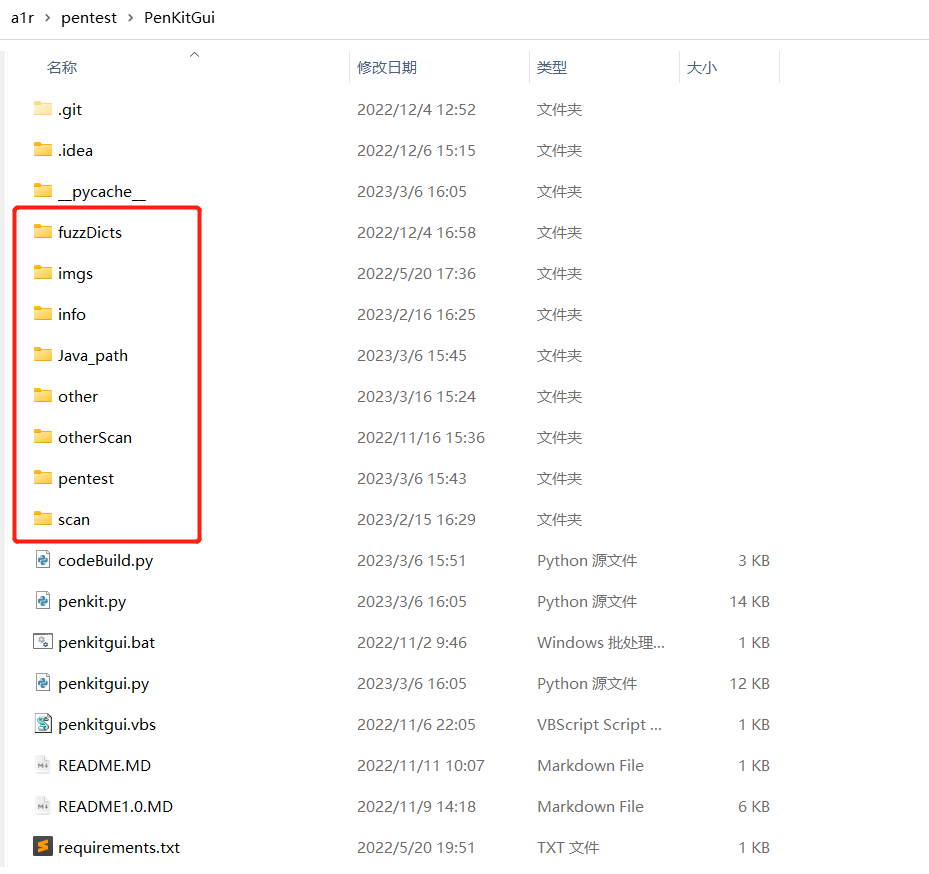

# 使用说明

PenKitGui_V2 无文件版，纯自己 DIY 你的工具箱，可以 diy 一个给团队成员用。

配置文件：setting.py、tools.yaml、requirements.txt
生成客户端的文件：codeBuild.py
运行后生成的文件：penkit.py、penkitgui.py（无需修改）
执行文件：penkitgui.bat、penkitgui.vbs
其他文件：README.MD

工具箱的主题、每行多少个按钮等具体配置在 setting.py 文件中。

V1 版本：<https://github.com/ccc-f/PenKitGui>

效果图：


## 如何使用

1、**下载 Java_Path**

奶牛快传无需客户端、无需登录
<https://cowtransfer.com/s/f8cac3b5133d4f>

下载后解压放到该目录下

2、**首先把你想要加入到工具箱的工具转移到该目录下，分类保存好**

方便编写 tools.yaml 文件



3、**编写 tools.yaml 文件**

可参考 tools.yaml.bak 文件

4、**安装依赖库**

pip install -r requirements.txt

5、**每次修改 tools.yaml 文件需要重新生成客户端**

python codeBuild.py

运行完该命令后，会生成两个文件 penkit.py、penkitgui.py，无需理会

6、**运行**

debug 模式运行，双击 penkitgui.bat

非 debug 模式运行，双击 penkitgui.vbs

## 四种格式的命令添加

1、**执行 exe 文件**

```
cd info/New 御剑 1.5\_加强字典版 && New 御剑 1.5.exe
```

2、**执行 jar 文件**

> 备注：内置了 {java8_path} 、 {java9_path}、{java17_path}

```
cd info/fofaviewer && {java8_path} -jar fofaviewer.jar
```

3、**打开命令行窗口，cd 到目标路径，不直接运行**

```
'{startCmd} "cd info/DirSearch"'
```

4、**执行 python 脚本**

> 备注：其中 python 运行解释器可以在 penkitgui.bat 文件中指定。

```
'{startCmd} "cd other/ddddocr && python ddddocr_server.py"'
```

## 自定义添加 java_path

> 备注：内置了 {java8_path} 、 {java9_path}、{java17_path} 三种环境

1、setting.py 文件中添加 java17 路径

```
java17_path = (tools_path + "\Java_path\java17\\bin\java").replace('\\','\\\\')
```

2、codeBuild.py 文件中的 gen_click 函数中导入 java17_path

```
from setting import java17_path
```

3、调用 java17 执行

```
{java17_path} 
```

双括号引用
